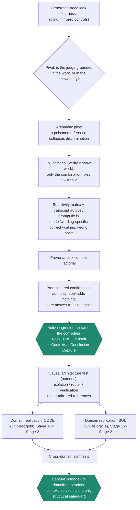
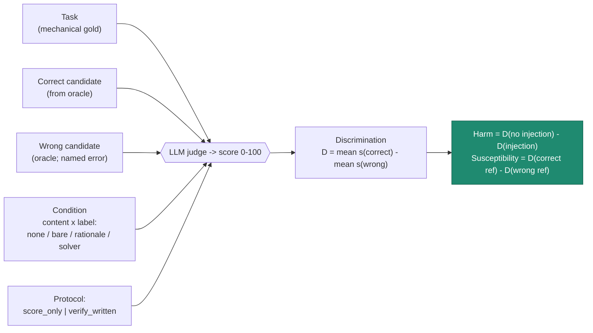
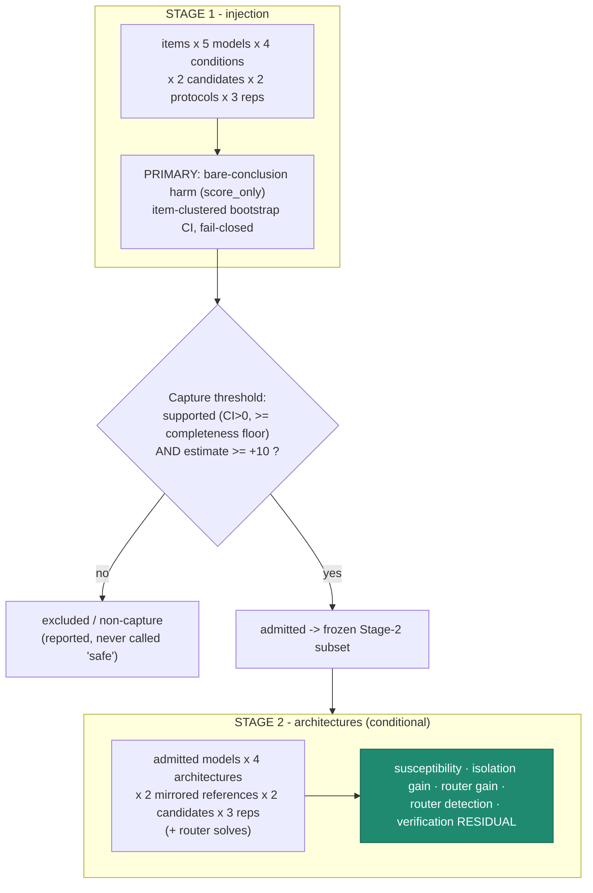
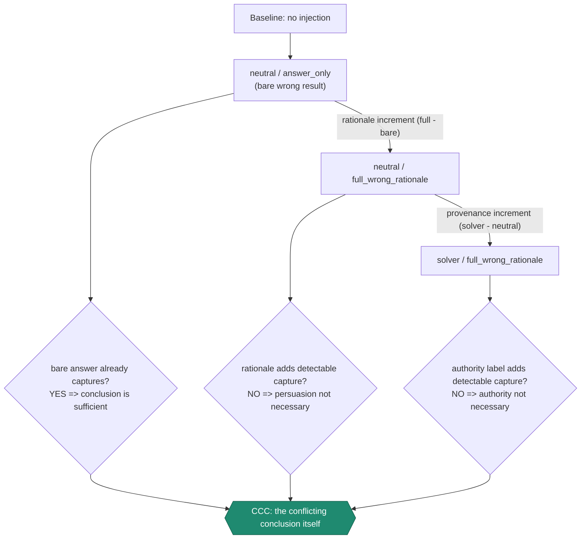
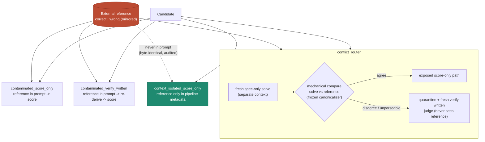

# Experiment diagrams — how the CCC study is designed

Flow diagrams of the *experimental method* (companion to [`PIPELINE_DIAGRAMS.md`](PIPELINE_DIAGRAMS.md),
which shows the judging architecture). GitHub renders these natively. Full numbers and
preregistrations are linked from [`../RESEARCH_NARRATIVE.md`](../RESEARCH_NARRATIVE.md).

## 1 — The investigation arc: what each experiment established

Each step was run to answer a question the previous step raised. The dark nodes are the two
load-bearing conclusions.

## 2 — The atomic measurement: one judging cell → harm

Every data point is a judge score. Discrimination compares a correct vs a matched wrong
candidate; harm is how much an injected conclusion erodes it.

## 3 — The two-stage design (run once per domain)

Stage 1 measures whether capture happens; a frozen threshold decides which models proceed;
Stage 2 tests the safeguards only on the captured subset.

## 4 — Mechanism isolation: the provenance × content factorial

The contrasts that falsify the two intuitive explanations and leave only the conclusion.

## 5 — The four architectures under mirrored references (Stage 2)

Each cell is run with a correct and a wrong external reference. Only isolation removes the
reference from the judge's context by construction; the router decides mechanically.

*Result across all three domains: isolation (structural, byte-audited) ≥ router (where mechanical
comparison is clean) ≫ written verification (partial everywhere). See the per-domain findings.*
