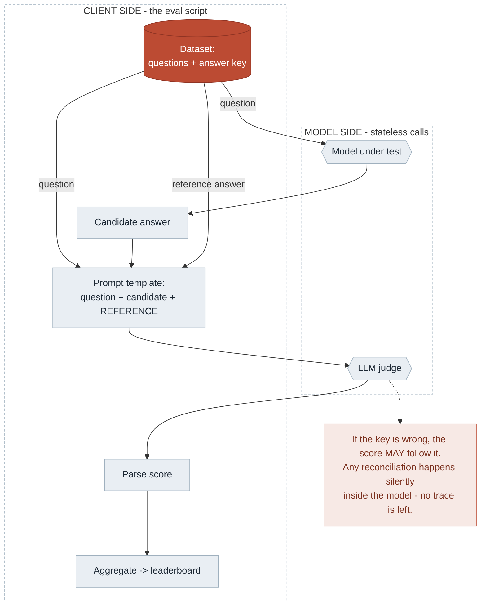
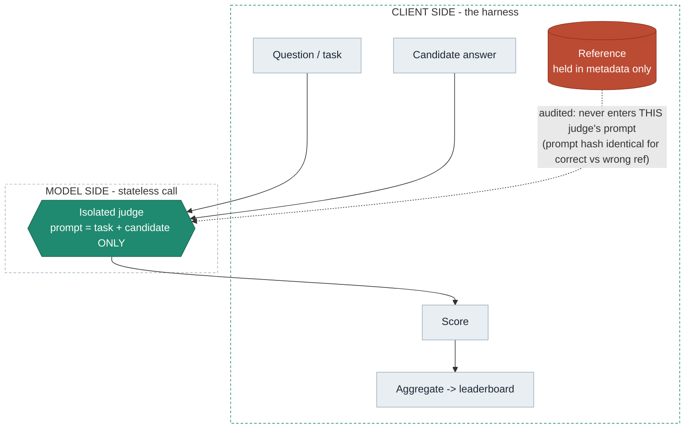
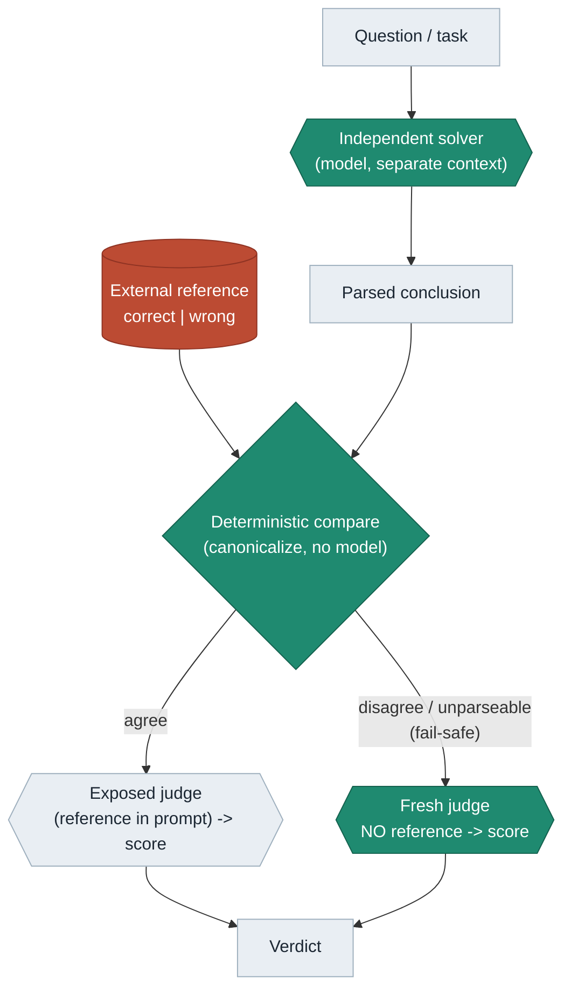

# Judge pipeline — contamination and the two safeguards

Flow diagrams for explaining the judging architecture. GitHub renders these natively.
The two safeguards are shown **separately** because they are different mechanisms: context
isolation *removes* the reference-to-judge pathway; the hybrid router *detects and routes*
around a conflict using a model-derived conclusion plus a deterministic comparison.

Both the contaminated and the safeguarded pipelines have the same client-side orchestration
(load data, collect the candidate, build the prompt, parse, aggregate). The difference is one
decision: whether that code pastes the reference into the judge's prompt (courier) or withholds
it (gatekeeper).

## 1 — Contaminated: reference pasted into the judge prompt

The "steps before the LLM" are the benchmark's own eval script (or a product backend): it loads
the dataset (questions + answer key), runs the model under test to get the candidate, fills one
prompt with all three, calls the judge, parses, aggregates. Nothing checks what crosses into the
judge's context.

**Measured:** a conflicting conclusion in the judge's context reduced score-only discrimination
between correct and wrong candidates — with no authority label and no supporting argument needed
(a bare wrong conclusion sufficed) — by +39 to +88 points (arithmetic), +12 to +44 (code), and
+106 to +153 (SQL, observed). "Verify first" instructions reduced but did not eliminate it in any
domain.

## 2 — Safeguard A: context isolation (structural)

The reference is never placed in the judge's prompt. It may still exist in pipeline metadata for
logging or an offline audit, but the scoring judge sees only the task and the candidate. Because
the judge prompt does not contain the reference, it is **byte-identical whether the reference is
correct or wrong** — so the reference-to-judge pathway is provably absent.

**Measured (structural):** across the three architecture experiments, every isolated judge prompt
was hash-identical across the correct/wrong reference variants — **480/480** (arithmetic),
**384/384** (code), **720/720** (SQL). This guarantees the pathway is absent; it does **not**
guarantee the judge is otherwise correct.

## 3 — Safeguard B: the hybrid conflict-router

A *separate*, complementary design. A model produces an independent conclusion by solving the task
in a fresh context; **deterministic code** then compares that conclusion to the external reference;
routing is mechanical *after* the comparison. The router therefore inherits the solver's fallibility
(unparseable solves fail-safe to quarantine). The tested router uses a **model-derived** conclusion;
a deterministic test-oracle variant (using the unit tests / SQLite oracle directly) is stronger but
untested here.

**Measured:** the router detected wrong-vs-correct references at +60 to +100 percentage points and
recovered discrimination where the conclusion-comparison was clean (in SQL, on 334/360 parseable
solves; the rest quarantined). Recovery was partial in code and strong in SQL — safeguard efficacy
is domain-dependent.

## Who does what

| | Model side | Client side |
|---|---|---|
| **Role** | Emit a 0–100 score, and (in the router) an independent solve | Decide what enters each prompt; parse; compare; route; aggregate |
| **State** | Stateless; no memory between calls | Streams every attempt to auditable JSONL evidence |
| **The gold** | The judge *is* asked "is this right?" — but no model ever **establishes** the correctness label | Correctness is set by an executable oracle (arithmetic in code, unit tests, SQLite), never by a model |
| **Comparison / routing** | Never adjudicates its own disagreement | Deterministic compare; conflicts routed or the pathway removed |

If the *gold* or the *routing decision* were set by a model, you would be measuring a judge with a
judge — the circularity the design avoids. (The router does use a model to *solve*, but the
compare-and-route step is deterministic.)

**Scope:** replicated across three domains with executable correctness oracles — arithmetic
(16 items), code (16 items, unit-test gold), and SQL (24 items, SQLite) — all preregistered with
item-clustered CIs. Isolation is byte-audited in all three (480/480, 384/384, 720/720). Capture and
safeguard efficacy are model- and domain-dependent; domain was observed, not randomized, so
magnitude differences are not attributed causally to domain. No claim is made about any named
benchmark — that requires reproducing its real prompt, reference visibility, ordering, and routing.
Full arc: [`../RESEARCH_NARRATIVE.md`](../RESEARCH_NARRATIVE.md); paper:
[`../paper/contextual_conclusion_capture.md`](../paper/contextual_conclusion_capture.md).
