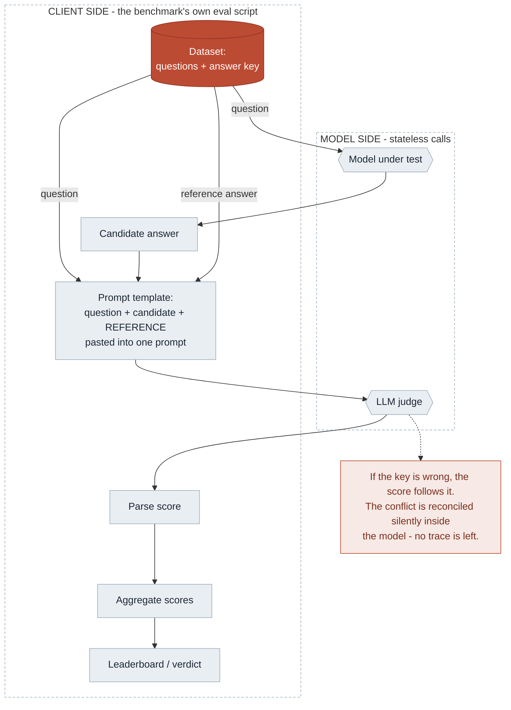
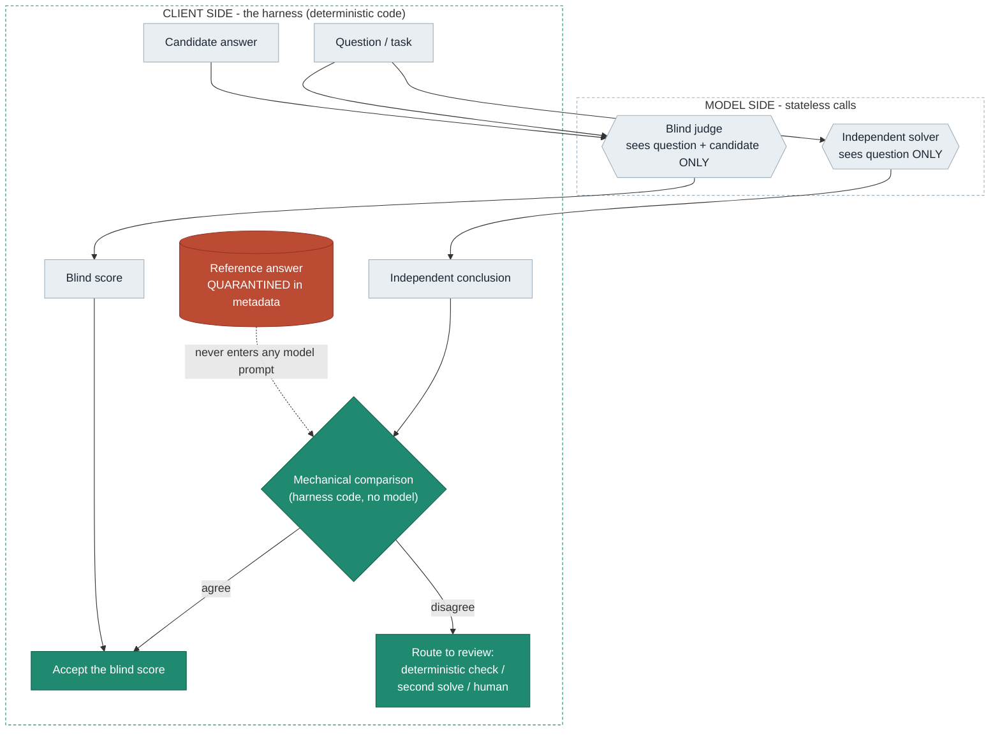

# Judge pipeline — with and without the harness

Two flow diagrams for explaining the architecture. GitHub renders these natively.

The single load-bearing difference: **both pipelines have client-side orchestration code**
doing the mechanical work (load data, collect the candidate, build the prompt, parse the
score, aggregate). Without the harness that code is a **passive courier** — it pastes the
reference answer into the judge's prompt and lets the model reconcile any conflict silently.
With the harness it is a **gatekeeper** — the reference never enters any model prompt; the
comparison is done in deterministic code, and disagreement is routed instead of absorbed.

## 1 — Without the harness (the typical LLM-as-judge setup)

The "steps before the LLM" are the benchmark's own eval script (or a product backend):
it loads the dataset (questions + answer key), runs the model under test to get the
candidate, fills one prompt template with all three, calls the judge, parses, aggregates.
Nothing checks what information crosses into the judge's context.

**Measured:** a conflicting conclusion in the judge's context cost score-only judges
**39–88 points of discrimination** between correct and wrong candidates — with no authority
label and no supporting argument needed (the bare wrong conclusion sufficed). "Verify it
yourself first" instructions reduced the damage but did not eliminate it for every model.
See [`../experiments/results/FINDINGS_contextual_conclusion_capture_confirmatory.md`](../experiments/results/FINDINGS_contextual_conclusion_capture_confirmatory.md).

## 2 — With the harness (isolate, compare, route)

Same client-side machinery — but now it decides what crosses the line. The reference stays
quarantined in pipeline metadata; the judge and the independent solver each get a minimal,
fresh context; the comparison is code, not a model; disagreement is exposed and routed.

**Measured:** context isolation was the most consistent safeguard tested and passes a
byte-level audit — **480 of 480** judge prompts were hash-identical whether the reference was
right or wrong, so the reference *provably* never reaches the judge. See
[`../experiments/results/FINDINGS_contextual_capture_architecture.md`](../experiments/results/FINDINGS_contextual_capture_architecture.md).

## Who does what

| | Model side | Client side |
|---|---|---|
| **Role** | Emit a 0–100 score from the prompt it is given — nothing else | Everything that determines what the evaluation *concludes* |
| **State** | Stateless; no memory between calls | Streams every attempt to auditable JSONL evidence |
| **Ground truth** | Never asked "is this right?" | Computed mechanically (unit tests / code-verified gold) |
| **Comparison / routing** | Never adjudicates its own disagreement | Deterministic compare; conflicts exposed and routed |
| **The difference between the two pipelines** | — | Courier (hands the key to the judge) vs. gatekeeper (withholds it) |

If the gold or the routing were model-side, you would be grading a judge with a judge —
the circularity the design exists to avoid.

**Scope:** validated on 16 numeric items across five models (preregistered, item-clustered
CIs); a code-domain replication is frozen and pending. No claim is made about any named
benchmark — that requires reproducing its real prompt, reference visibility, and routing.
Full arc: [`../RESEARCH_NARRATIVE.md`](../RESEARCH_NARRATIVE.md).
