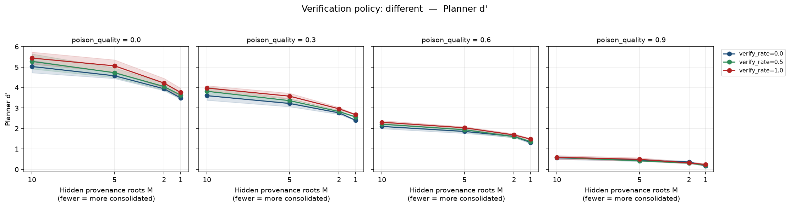
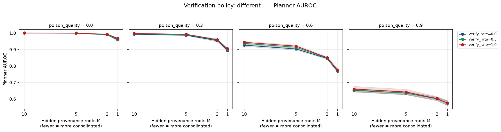
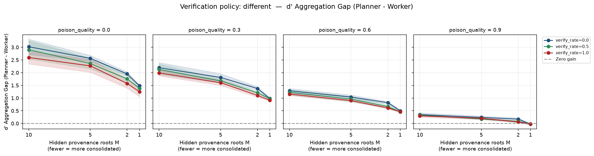
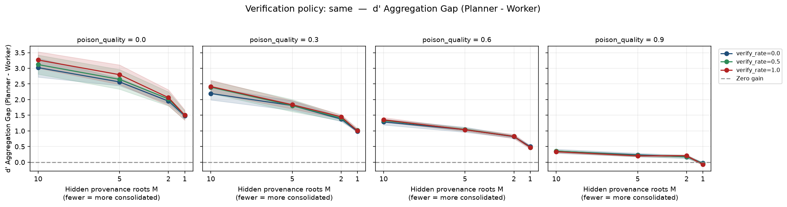
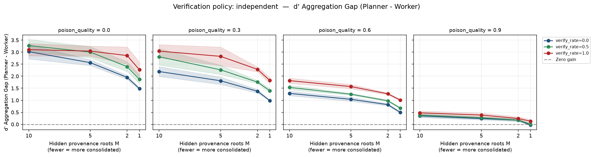

# Swarm Discrimination-Collapse Simulation (V4)

This walkthrough documents the analysis of the V4 simulation, which formalises the mechanism of provenance-induced collapse and yields quantitative predictions regarding the "aggregation penalty".

Every number quoted below is emitted by `analysis_tables.py` against `v4_sweep.csv`, so the write-up can be audited against the sweep rather than eyeballed off the charts.

## 1. The Provenance Mechanism (Silent Collapse)

The core mechanism focuses on exploiting the aggregation step. When multiple apparent sources are merely clones of a single false narrative (i.e., $M$ hidden provenance roots is much smaller than $N$ apparent sources), the swarm's aggregation logic falsely treats correlated errors as independent corroboration.

Within this provenance-explicit signal model, reducing the number of independent roots can reduce the benefit of majority aggregation even when individual workers' marginal discrimination remains approximately unchanged. Quality degrades workers; roots do not:

| worker d′ | M=10 | M=5 | M=2 | M=1 |
|---|---|---|---|---|
| poison_quality = 0.0 | 2.300 | 2.295 | 2.256 | 2.253 |
| poison_quality = 0.3 | 1.621 | 1.622 | 1.582 | 1.589 |
| poison_quality = 0.6 | 0.933 | 0.934 | 0.904 | 0.912 |
| poison_quality = 0.9 | 0.242 | 0.239 | 0.217 | 0.230 |

*(Averaged over verify rates and policies.)* Reading across any row, worker discrimination is flat in $M$. Reading down any column, it collapses in poison quality. These are two separate axes, and only the planner is sensitive to the first.

### Silent Collapse at Extreme Poisoning

To demonstrate that this collapse is "silent," we compare the swarm's operational metrics at 10 roots vs. 1 root under the headline condition (`poison_quality=0.9`, `different` policy).

| Metric (vr=0.0) | 10 Independent Roots | 1 Shared Root | Delta |
|---|---|---|---|
| **Planner D** | 0.214 | 0.071 | −0.142 |
| **Planner AUROC** | 0.652 | 0.575 | −0.077 |
| **Commit rate** | 0.768 | 0.849 | +0.081 |
| **Abstain rate** | 0.232 | 0.151 | −0.081 |
| **Mean latency** | 0.000 | 0.000 | 0.000 |

*Observations*: Moving from 10 independent roots to 1 shared root causes discrimination to fall significantly. However, the commit rate actually *increases* (the swarm is more decisive), and there is no latency or abstention signal to indicate an ongoing attack. The swarm operates completely normally while losing its discriminative power, establishing a true silent collapse. The same pattern holds at `vr=0.5` (Planner D −0.140, AUROC −0.080, commit rate +0.073, latency delta 0.000): verification changes the latency *level* but not the difference between the attacked and unattacked conditions, so latency carries no signal about the attack either way.

### Planner d' and AUROC (Different Apparent Source)

The primary realistic condition is `different_apparent`, simulating a web-search/RAG workflow where agents cross-check information against other apparently distinct sources.





*Observations*: Under high poison quality, reducing the number of provenance roots (moving left-to-right on the x-axis) induces a silent collapse. The aggregation advantage over a single average worker shrinks monotonically as poison quality rises. In the extreme case (Quality=0.9, Roots=1), the aggregation gain vanishes and turns marginally negative, as shown below:

| poison_quality | worker d′ | planner d′ | gain |
|---|---|---|---|
| 0.0 | 2.010 | 3.492 | +1.482 |
| 0.3 | 1.416 | 2.402 | +0.986 |
| 0.6 | 0.818 | 1.317 | +0.499 |
| 0.9 | 0.209 | 0.180 | −0.029 |

*(Measured at roots=1, verify_rate=0.0.)* The planner's redundancy premium is spent, while the average worker's competence is merely degraded by the quality of the poison. Note that the q=0.9 row compares two near-floor numbers: the honest reading is that the aggregation gain has vanished, not that the planner has become a net liability.

### Mechanism: Selective Disablement of Verification

A subtle finding emerges from the verification policies at `roots=1`. At this extreme, every poisoned apparent source shares the exact same root. Thus, on *poisoned* tasks, checking a `different` source is mathematically identical to checking the `same` source. Yet `different` still scores higher overall:

| policy (q=0.6, roots=1, vr=1.0) | planner_D | share of gap closed |
|---|---|---|
| none (vr=0) | 0.488 | — |
| `same` | 0.495 | ~4% |
| `different` | 0.532 | ~23% |
| `independent` | 0.715 | see below |

*(Gap = 0.196, from the M=10 unverified reference of 0.683.)*

The reason `different` outperforms `same` here is that genuine tasks *always* have $M=N$, meaning that switching apparent sources does reach a fresh root on genuine tasks. Decomposing the planner's accept rates by class makes this exact rather than inferred:

| policy (q=0.6, roots=1, vr=1.0) | P(accept \| genuine) | P(accept \| poisoned) |
|---|---|---|
| `same` | 0.7874 | 0.2923 |
| `different` | 0.8247 | 0.2923 |
| **`different` − `same`** | **+0.0373** | **+0.0000** |

The poisoned-class term is zero to the last digit — as the mechanism requires, since at $M=1$ the two policies are reading the same hidden root. The entire margin sits on the genuine class. Sweeping $M$ shows the genuine-side benefit is invariant while the poisoned-side term is the only thing that moves:

| `different` − `same` (q=0.6, vr=1.0) | M=10 | M=5 | M=2 | M=1 |
|---|---|---|---|---|
| Δ P(accept \| genuine) | +0.0373 | +0.0373 | +0.0373 | +0.0373 |
| Δ P(accept \| poisoned) | +0.0085 | +0.0035 | +0.0352 | +0.0000 |

**Coherent poison doesn't degrade cross-checking in general — it disables cross-checking selectively, precisely on the items where it was needed, while leaving it working on the items where it wasn't.** A defender measuring verification effectiveness in aggregate would see it apparently working and conclude the control was sound.

> [!NOTE]
> The poisoned-class row is not monotone in $M$ (it peaks at $M=2$), so only its collapse to exactly zero at $M=1$ is load-bearing here. The intermediate values reflect a second-order effect this model does not isolate: under `different`, two workers can average in each other's roots, correlating their signals and fattening the tails of the accept-fraction on which the planner thresholds. That is a separate mechanism from provenance consolidation and is not claimed as a result.

## 2. Policy Contrasts

To test whether the collapse is fundamentally a provenance dependence issue, we simulated three verification policies as planned contrasts:

1. **Same Apparent Source (Negative Control)**: Same-source verification cannot escape poisoned provenance, although repeated measurement may reduce independent observation noise.
2. **Different Apparent Source (Realistic Condition)**: Verification attempts to diversify sources but fails because superficial diversity masks hidden correlation.
3. **Independent Provenance (Positive Control)**: Verification is forced to use an independent provenance draw with the same marginal class reliability.

### Aggregation Gap (Same Apparent vs Independent Provenance)




*Observations*:
- Verification recovers more discrimination when it reaches a genuinely independent provenance than when it merely selects another apparent source.
- `independent_provenance` substantially restores discrimination in this sweep relative to the unverified baseline, demonstrating that the vulnerability is strongly tied to provenance dependence.

### What "restored" means depends on the comparator

The `independent` figure needs its reference stated, because against the M=10 *unverified* baseline it overshoots:

| comparator (q=0.6) | value | `independent` at roots=1, vr=1.0 | share of gap closed |
|---|---|---|---|
| M=10 unverified (0.683) | 0.683 | 0.715 | **115.9%** |
| M=10 verified, like-for-like (0.837) | 0.837 | 0.715 | **65.0%** |

The overshoot is not a rescue beyond full — it is that the idealised policy also lifts the reference itself. Held to a like-for-like comparator (the same `independent` policy at `vr=1.0` with M=10 roots), provenance-aware verification recovers about two-thirds of what consolidation destroyed, not all of it. **"Fully restores discrimination" is the wrong claim in either direction; the defensible one is that provenance-aware verification recovers a large majority of the loss, and provenance-blind cross-checking recovers almost none of it (~23% for `different`, ~4% for `same`).**

## 3. Retraction of V3 "Verification Backfire" Artifact

> [!WARNING]
> **Corrected Prediction**: The V3 simulation initially suggested a "verification backfire" where verification could actively harm planner accuracy.
>
> **Correction**: The V3 backfire result does not survive V4. Same-source verification may reduce independent observation noise, but it cannot escape the shared provenance component; no general backfire effect is supported.

## 4. Model Limitations

> [!NOTE]
> V4 contains an explicit design limitation: tasks contain either an entirely genuine or entirely poisoned source bundle. The simulation does not yet model genuine and poisoned evidence coexisting within one task. This bounds the interpretation to controlled mechanism experiments rather than fully realistic mixed-evidence scenarios.

A second limitation worth naming: the model was *built* so that consolidating provenance reduces the information carried by $N$ votes. It therefore cannot fail to produce an aggregation penalty. What the simulation supplies is not proof that the penalty exists in real swarms, but a formalisation of the mechanism and a set of quantitative predictions that follow from its assumptions. Where real LLM workers actually sit on the roots axis remains the open empirical question.

## 5. Reproduction

```
python3 v4_simulation.py    # writes v4_sweep.csv, runs the CRN identity test
python3 plot_v4.py          # writes the 5 figures referenced above
python3 analysis_tables.py  # prints every table quoted in this document
```

Sanity checks that must hold on any re-run:

- **CRN identity test**: at `poison_roots=10` the treatment must reproduce the matched baseline exactly. Observed `max |planner_D delta| = 0.0`, `max |commit delta| = 0.0`.
- **Metric agreement**: planner d′ and planner AUROC must rank the conditions the same way. Observed Spearman ρ = 0.9834.
