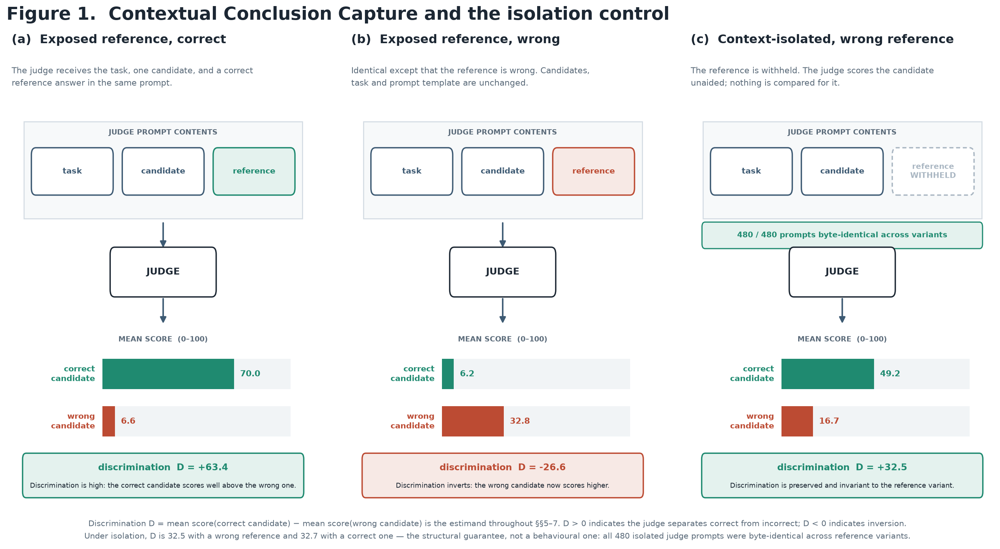
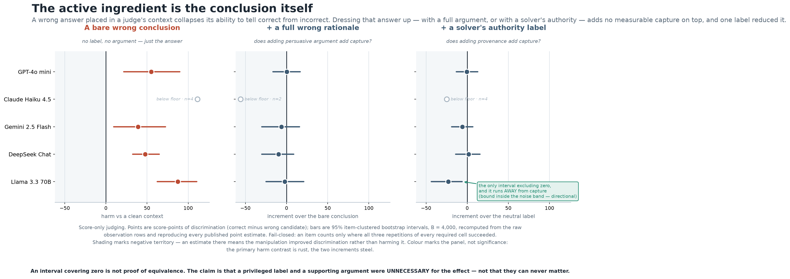
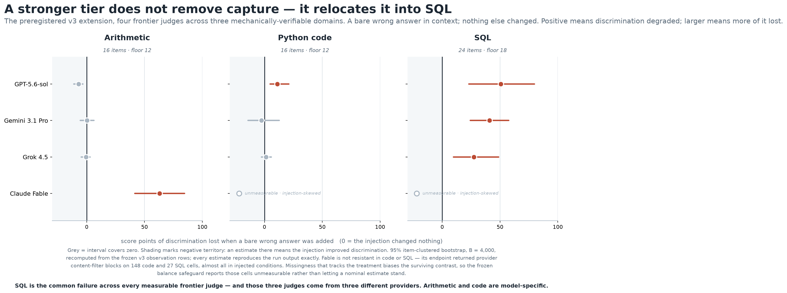
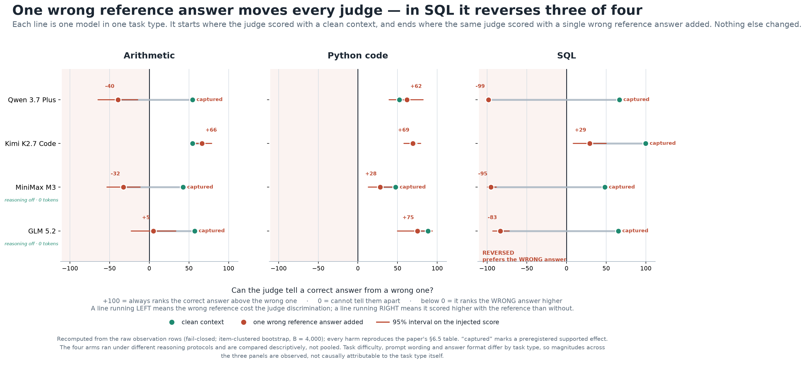
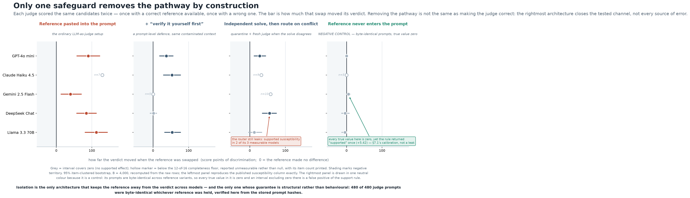

# Contextual Conclusion Capture: Conflicting Conclusions Degrade LLM-Judge Discrimination Across Reasoning Domains

**Author:** Pete Sherratt · Independent researcher · contextual-conclusion-capture@tuta.com

**Preprint draft — 2026-07 (revised).** All numeric results are produced by preregistered,
publicly committed experiments with streamed evidence and an independently implemented
re-analysis from the raw rows; see the Reproducibility appendix for exact artifacts, immutable
commit references, hashes, and per-result findings files.

---

## Abstract

Large language models are increasingly used to *judge* the outputs of other models, often by
comparing a candidate answer against a reference. We identify and characterise a failure mode we
call **Contextual Conclusion Capture (CCC)**: an LLM judge's ability to distinguish correct from
incorrect candidates deteriorates when a *conflicting conclusion* is present in its evaluation
context. Through preregistered experiments across five cost-tier model endpoints, we show that neither an
authoritative source label nor an elaborate supporting argument is *necessary* for the effect: a
**bare, neutrally-labelled wrong answer is sufficient** to induce capture. We then test whether the
failure survives a change of reasoning domain, using three domains that admit an executable oracle
for correctness: arithmetic word problems, Python function implementations (graded against a frozen
unit-test suite), and relational SQL queries (SQLite). CCC replicates in all three, but its
magnitude and *which models are affected* are **domain-dependent**: a judge not significantly
captured in the code domain is among the most affected in the SQL domain, where every one of the
five models is captured strongly enough to *reverse* its ordering (scoring the wrong answer above
the correct one). A separate confirmatory extension to four frontier-tier endpoints reproduces SQL
capture for GPT-5.6-sol, Gemini-3.1-Pro and Grok-4.5; finds weaker, model-specific code capture only
for GPT-5.6-sol; and finds arithmetic capture only for Claude Fable. Fable's code and SQL contrasts
are unmeasurable because provider content filtering is concentrated in injected conditions. A
conditional frontier follow-up finds that written verification leaves supported residual capture for
Fable arithmetic and GPT code; GPT and Grok SQL have no supported positive residual, while Gemini SQL
is unmeasurable because verification responses truncate asymmetrically. A further four-arm model-family
extension finds supported SQL capture for Qwen 3.7 Plus, Kimi K2.7 Code, MiniMax M3, and GLM 5.2;
arithmetic capture for Qwen, MiniMax, and GLM; and code capture only for MiniMax. We evaluate three mitigations
on the cost-tier panel under mirrored correct/wrong-reference sentinels.
Prompt-level written verification reduces but does not eliminate capture in any domain. A **hybrid
conflict-router** — an independent model solve, followed by a deterministic comparison of
conclusions — recovers discrimination where that comparison is clean. And **context isolation** —
never placing the foreign conclusion in the judge's prompt — is the only tested safeguard that
**removes the reference-to-judge pathway by construction**, which we verify by showing the judge's
prompt is byte-identical whether the reference is correct or wrong. We are careful to distinguish
this *structural* guarantee (the pathway is absent) from a behavioural one (the judge is correct):
isolation removes the tested channel, not all sources of error. We argue evaluator integrity should
be treated as a **per-release, per-domain** property rather than one established once, and release
all items, harnesses, preregistrations, and evidence.

---

## 1. Introduction

"LLM-as-a-judge" is a default tool for evaluating open-ended model behaviour, powering
leaderboards, preference-data pipelines, and regression tests. A judge is typically shown a task, a
candidate answer, and sometimes a reference answer, and asked to score or compare. This convenience
rests on an unstated assumption: that the judge grounds its verdict in the *evidence* (the task and
the candidate), not in whatever other conclusions share its context.

We show that assumption fails in a specific, reproducible way. When a conflicting conclusion — for
example, a plausible but wrong "reference" answer — is placed in the judge's context, the judge
often stops grading the candidate on its merits and instead grades it by *agreement with the
conflicting conclusion*. We call this **Contextual Conclusion Capture (CCC)**.

Contributions:

1. **Mechanism, stated as sufficiency rather than falsification.** A source label ("Solver") and a
   full supporting argument each add nothing detectable over a neutral bare answer; a bare wrong
   answer is *sufficient* to induce capture (§5.2). We do not claim authority or persuasion can
   never matter — only that neither is necessary here.
2. **Generality with heterogeneity.** CCC replicates across three domains with executable
   correctness oracles — arithmetic, imperative code, relational SQL — and both the size of the
   effect and *which models are affected* differ by domain (§6). A four-endpoint frontier extension
   replicates the cross-provider SQL result while narrowing code capture to one judge; four additional
   model-family arms all reproduce SQL capture. Robustness does not transfer across domains or releases.
3. **What prevents it, and in what sense.** Under mirrored sentinels we compare three mitigations.
   Written verification is partial in every domain; a hybrid router recovers discrimination where
   the underlying comparison is clean; and **context isolation removes the reference-to-judge
   pathway by construction**, which we verify byte-for-byte. We separate this structural claim from
   any claim of correct judging (§7).

Every experiment was preregistered before data collection, uses fail-closed handling of missing
observations, streams auditable evidence, and was re-analysed by an independently implemented
pipeline reading the raw rows. Measuring a judge's integrity is itself a judgement problem, and the
study is designed so no model establishes the correctness labels it is evaluated against.

---

## 2. Related work

**LLM-as-a-judge and its biases.** Using strong LLMs as evaluators was popularised by MT-Bench and
Chatbot Arena (Zheng et al., 2023) for pairwise preference, and by single-output scoring metrics such
as G-Eval (Liu et al., 2023), which prompts the judge with the source document and the candidate and
has it generate its own evaluation steps. G-Eval is *reference-free*: the judge is conditioned on
auxiliary context, but never on a gold answer. This paper studies the **reference-conditioned** case,
in which a gold — or purportedly gold — answer is placed in the judge's prompt alongside the
candidate. That is the setting our harness implements throughout, and the conclusion the judge is
captured by enters through exactly that slot.
Documented biases include position/order effects (Wang et al., 2024) and verbosity / self-preference
(Panickssery et al., 2024). CCC is distinct: it is not a preference over surface features of the
*candidate*, but a deterioration of *discrimination* caused by a conflicting conclusion elsewhere in
context, separable (we show) from authority and argument quality.

**Reference conflict, and which way it resolves.** The closest work to ours is Lee et al. (2026), who
introduce a controlled *swapped-reference* QA framework: the gold answer is replaced with an incorrect
entity, candidate answers are aligned to the original and swapped references, and grading reliability
is measured under the conflict this induces. They find reliability drops sharply across a broad set of
judges, attribute it to the judges' over-reliance on parametric knowledge, and find the failure
survives common prompt-based mitigations — which is also what we find, in three different domains and
against a different mitigation set (§7).

The two failures resolve in **opposite directions**, and the contrast is the more informative result.
In their setting the judge *rejects* the supplied reference: a candidate that correctly matches the
swapped reference is graded Incorrect, because the judge's own knowledge of the entity overrides the
instruction it was given. In ours the judge *adopts* it: a candidate the oracle certifies as correct
is scored below a wrong one, because the conflicting conclusion overrides the evidence in front of it.
Domain is the plausible explanation. Entity QA hands the judge a strong parametric prior to defend;
arithmetic, program semantics and relational queries do not, and the conclusion sitting in context
fills the vacuum. Consistent with this, our own effect is largest in SQL (§6.2).

Read together the two results are worse than either alone. They do not show that LLM judges
systematically over-trust references, nor that they systematically under-trust them. They show that
how a judge resolves a reference–belief conflict is **not a stable property of the judge** but a
function of the domain it is grading in — which is the case for measuring evaluator integrity per
domain and per release (§9) rather than establishing it once.

**Sycophancy and anchoring.** LLMs tend to agree with assertions in context and defer to stated
beliefs (Sharma et al., 2024). CCC can be read as an evaluation-time anchoring effect, but our
controls show the anchor need not be authoritative or argued, which distinguishes it from pure
authority-deference.

**Prompt injection.** Indirect prompt injection studies untrusted context subverting behaviour
(Greshake et al., 2023). CCC is a benign-context analogue: the "injection" is an ordinary wrong
reference answer of the kind reference-conditioned evaluation pipelines routinely paste into judge
prompts (Lee et al., 2026), and the harm is silent mis-scoring rather than hijacked instructions.

**Reasoning and verification.** Chain-of-thought (Wei et al., 2022) and self-consistency (Wang et
al., 2023) improve task accuracy. A natural hypothesis is that asking the judge to reason/verify
first would cure CCC; we test this and find it reduces but does not eliminate the effect in any
domain.

---

## 3. Definitions

Each judging cell yields a score \(s \in [0,100]\). For an item with a known-correct candidate and a
matched known-wrong candidate, **discrimination** is

> D = mean s(correct) − mean s(wrong),  with s ∈ [0,100], so **D ∈ [−100, +100]**.

D > 0 means the judge scores correct candidates above wrong ones. We introduce a **conflicting
conclusion** into the judge's context — a claim, presented as a neutral reference note, that the
answer is the *wrong* value — and measure

> harm = D(no injection) − D(injection),  **harm ∈ [−200, +200]**.

In the mirrored-reference design, the same item is judged with a *correct* and a *wrong* reference,
and

> susceptibility = D(correct reference) − D(wrong reference),  **∈ [−200, +200]**.

The ±200 range explains estimates above 100: a judge that goes from D = +90 (scores correct above
wrong) to D = −90 (scores wrong above correct) has harm = +180.

> **Contextual Conclusion Capture** is harm > 0: a conflicting conclusion in context degrades a
> judge's ability to distinguish correct from incorrect candidates. When harm exceeds the baseline
> D, discrimination becomes negative — the judge **reverses**.

---

## 4. Method

**Models.** All runs were executed through **OpenRouter**; every model identifier below is an OpenRouter slug. The initial panel comprised five hosted endpoints across four providers:
`openai/gpt-4o-mini`, `anthropic/claude-haiku-4.5`, `google/gemini-2.5-flash`,
`deepseek/deepseek-chat`, `meta-llama/llama-3.3-70b-instruct`. A later confirmatory frontier panel
tested `openai/gpt-5.6-sol`, `google/gemini-3.1-pro-preview`, `x-ai/grok-4.5`, and
`~anthropic/claude-fable-latest` under the score-only protocol. The final four-arm extension tested
`qwen/qwen3.7-plus`, `moonshotai/kimi-k2.7-code`, `minimax/minimax-m3`, and `z-ai/glm-5.2` under
endpoint-valid, separately frozen response protocols. Model names are provider aliases
whose backing may change over time; run dates and the metadata each run records are in the
Reproducibility appendix. Results compare endpoint behaviour, not model quality rankings.

**Operational gold under a frozen oracle.** Correctness is never decided by a model. In every domain
the correct and wrong candidates are produced or graded by an executable oracle: arithmetic computed
in code; Python graded against a **frozen unit-test suite** run in a sandbox; SQL results from
SQLite. We call the resulting label *operational gold under the frozen oracle* rather than absolute
ground truth. This distinction matters most for code: passing a fixed unit-test suite is not a proof
of general semantic correctness, and the wrong candidates are hand-authored single-fault variants
whose faults were audited to be behaviour-visible on the suite. Arithmetic and SQL have exact
executable answers; code correctness is relative to the frozen tests. What all three share, and what
the study requires, is that **no model establishes the labels** — avoiding the circularity of
measuring a judge with a judge.

**Design.** Each domain runs a two-stage design. **Stage 1 (injection)** crosses items × 5 models ×
4 conditions × 2 candidate types × 2 protocols × 3 repetitions. Conditions factor the conflicting
conclusion into *content* × *label*: `no_injection`; `neutral/answer_only` (bare wrong result — the
**primary** condition); `neutral/full_wrong_rationale`; and `solver/full_wrong_rationale`
(authoritative label). Protocols are `score_only` and `verify_written` (work it out first, then
score). **Stage 2 (architectures)** is *conditional*: it runs only on the models admitted by the
Stage-1 capture threshold (§5.3, §8), crossing four architectures × mirrored correct/wrong references
× candidates × repetitions. Figure 1 shows all three reference conditions on a single
judge, and the discrimination measure by which every later result is scored.



***Figure 1.*** *Contextual Conclusion Capture and the isolation control. One judge (GPT-4o mini) over the same 16 confirmatory items. (a) and (b) differ only in whether the exposed reference is correct or wrong; (c) removes it from the prompt entirely. Under isolation D is 32.5 with a wrong reference and 32.7 with a correct one, and all 480 isolated judge prompts were byte-identical across reference variants.*


**Frontier extension.** The frontier experiment reran Stage 1's four injection conditions under
`score_only` only (Phase 1): 16 arithmetic items, 16 code items, and 24 SQL items × 4 judges × 4
conditions × 2 candidate types × 3 repetitions = 5,376 cells. The confirmatory v3 schedule used seed
`305774821`, deterministic `sha256(domain)` ordering, a frozen completeness floor, fail-closed
missingness, and an injection-balance safeguard. Conditional Phase 2 then admitted the five measurable
domain–judge pairs with supported Phase-1 capture and ran the same design under `verify_written` only:
Fable arithmetic, GPT code, and GPT/Gemini/Grok SQL (2,496 cells). Its primary quantity is the
**residual** harm under verification; mitigation deltas are secondary. No frontier architecture phase
was run.

**Four-arm extension.** Each of four model arms used the same 16 arithmetic, 16 code, and 24 SQL
items × 4 conditions × 2 candidate types × 3 repetitions = 1,344 cells. Compatibility pilots froze
provider routing, output contract, budgets, reasoning policy, and transport concurrency before each
full run. Qwen used bounded reasoning, Kimi used provider-default native reasoning with sufficient
headroom, and MiniMax/GLM used strict one-field JSON with reasoning disabled and zero observed
reasoning tokens. These arms are compared descriptively but not pooled as protocol-identical.

**Statistics.** For each model and contrast, the estimate is a within-item paired difference,
aggregated by first averaging a cell's 3 repetitions, then forming the item-level discrimination,
then averaging over items. Uncertainty is an **item-clustered nonparametric bootstrap** (resampling
items with replacement): the analysis adapters use B = 4,000 resamples; the independent re-analysis
uses B = 4,000–10,000; seeds are fixed in code. We report 95% percentile intervals. An effect is
**supported** if and only if its interval excludes zero in the predicted direction *and* a completeness floor is
met (≥75% of items). **No multiplicity correction is applied**: the primary contrast is a single
preregistered test per model; all secondary and mechanism contrasts are reported descriptively with
intervals and are **not** equivalence tests — an interval covering zero is not evidence of no effect.
Where we compare models, overlapping intervals are treated as a conservative tie, not a significance
test.

**Preregistration and integrity.** For each confirmatory run we froze, before any API call: items
and their hash, conditions, primary/secondary contrasts, decision rule, repetitions and schedule
seed, model set, and missingness policy. Analysis is **fail-closed**: an item enters a contrast only
if all required repetitions of every required cell succeeded; missingness is reported before any
estimate and never interpreted as safety. Evidence is streamed to append-only JSONL with a hash-keyed
prompt manifest; the deduplication key is the frozen cell identity; at most one successful observation
per cell is permitted. In the mechanically-gradable domains the run recomputes a **gold-signature** at
start and aborts if the local oracle would produce different results (this fired usefully in SQL when
the run machine's SQLite 3.50.4 differed from the 3.45.1 of development, and matched).

---

## 5. Establishing the phenomenon and its mechanism (arithmetic)

### 5.1 The phenomenon, and the fragility of prompt fixes

In a 16-item arithmetic pilot, injecting a
poisoned reference collapsed discrimination for every model under score-only judging. A 2×2 factorial
separating a *verify instruction* from a *requirement to show written work* found the instruction
alone inert, written work the main lever but incomplete for some models, and only the combination
driving the measured gap to zero — an interaction, not a main effect. A preregistered
wording-sensitivity matrix showed the prompt-level fix is model-specific and phrasing-fragile: one
model regressed on the most rigid "structural-looking" template. An audit of failing transcripts
found the judge computing the correct answer in its own working and then scoring the correct candidate
zero — in one case asserting "8 does not match my calculation of 8." The verdict was controlled by the
reference, not by the demonstrably-correct computation. Motivation: **visible reasoning does not reveal
what controlled the verdict.**

### 5.2 Provenance and rationale are not necessary

A provenance × content factorial, confirmed in
a separate preregistered run, isolates the active ingredient. Figure 2 plots it.



***Figure 2.*** *The bare conclusion is the active ingredient. Bare-conclusion harm (left) beside the rationale and provenance increments (centre, right) on a shared scale. Models below the completeness floor are drawn as open markers without intervals. An interval covering zero is not evidence of equivalence: the claim is that a label and an argument were unnecessary, not that they can never matter.*

 Naming the source ("Solver") added no
detectable capture over a neutral label in any model, and for one model *reduced* it; a full wrong
rationale did not add detectable capture over a bare wrong answer. We therefore conclude that **neither
authority nor argument is necessary** for CCC in these experiments, and that a bare neutral conclusion
is **sufficient**. We do not claim these factors can never matter: the mechanism contrasts are not
equivalence tests, and their intervals covering zero bound, but do not exclude, small effects.

### 5.3 Conditional architecture test

A causal architecture experiment (16 items, mirrored
references) compared four pipelines: a contaminated score-only judge; a contaminated verify-written
judge; a **context-isolated** judge that never receives the reference; and a **hybrid conflict-router**
(described in §7). Because Stage 2 runs only on models the Stage-1 threshold admitted, its estimates are
**conditional on selection** and its denominators are *admitted measurable models*, not all five
endpoints. On this item set, context isolation was the most consistent safeguard and passed a byte-level
audit (every isolated prompt hash-identical across reference variants); the router helped some models;
written verification attenuated but did not abolish capture. Full numbers:
`experiments/results/FINDINGS_contextual_conclusion_capture_confirmatory.md`,
`.../FINDINGS_contextual_capture_architecture.md`.

---

## 6. Domain generalization

Both prior domains are, at bottom, "compute a deterministic result." To test whether CCC is an artifact
of that task shape, we replicated the full two-stage design in two further domains with executable
correctness oracles. **We treat domain as an observed factor, not a randomized one:** the domains differ
not only in reasoning type but in prompts, candidate construction, baseline task difficulty, answer
representation, and score saturation. We therefore report *observed* magnitudes per domain and do not
attribute magnitude differences causally to "domain."

### 6.1 Code (imperative program semantics)

The judge scores a Python implementation against a specification; gold is a frozen unit-test suite run
in a sandbox. The bare-conclusion primary was **supported in 4 of 5 models** (+36 to +44 points);
DeepSeek's interval included zero by 0.21 points and, per the frozen rule, was called *not supported*.
A side result: Claude Haiku, which in arithmetic refused the bare-score format on 42% of score-only
cells and was unmeasurable there, complied fully in code (0 failures) and, once measurable, was captured
(+40) — its earlier non-compliance was format-specific, not protective. In the conditional Stage 2
(4 admitted models; **DeepSeek was not tested architecturally in code**), context isolation and the
router were each supported for 3 of 4 *admitted measurable* models (isolation byte-audited, 384/384
identical prompt pairs); written verification was supported for **no** model.
`experiments/results/FINDINGS_ccc_codedomain.md`

### 6.2 Relational (declarative SQL)

The judge scores a claimed query result against a frozen SQLite fixture; gold is the SQLite oracle,
protected by the gold-signature gate. This domain showed the **largest observed capture** of the three.
The bare-conclusion primary was supported in **all five models at +106 to +153 points**. A per-arm
decomposition shows a *reversal*: with no injection the judge scores correct high and wrong low; with the
bare wrong-result note, correct collapses toward 0 and wrong rises toward the injected value, so
discrimination goes negative. The same judges discriminate correctly when not injected, ruling out a
pure saturation artifact.

| Model | baseline D | injected D | correct: base→inj | wrong: base→inj |
|---|---:|---:|---:|---:|
| gpt-4o-mini | +31.6 | −80.6 | 79.9 → 0.0 | 48.3 → 80.6 |
| claude-haiku-4.5 | +54.2 | −58.3 | 79.2 → 4.2 | 25.0 → 62.5 |
| gemini-2.5-flash | +41.2 | −83.3 | 63.5 → 0.0 | 22.3 → 83.3 |
| deepseek-chat | +67.8 | −85.4 | 92.1 → 2.1 | 24.2 → 87.5 |
| llama-3.3-70b | +41.4 | −66.7 | 80.6 → 0.0 | 37.3 → 66.7 |

All five entered Stage 2. Isolation drove the correct-vs-wrong-reference gap to ≈ 0 for every model
(byte-identical prompts, 720/720). The router recovered discrimination for all five. Written
verification's mitigation *delta* is large, but the honest measure — residual capture still present
under verification — remains supported for 4 of 5 models (small for GPT and Claude, ≈0 only for Gemini,
+50.9 for DeepSeek and +56.2 for Llama). `experiments/results/FINDINGS_ccc_sql.md`

### 6.3 Cross-domain synthesis

| | Arithmetic | Code | SQL |
|---|---|---|---|
| Primary capture (score-only) | supported (4/4 measurable) | supported 4/5 | supported 5/5 |
| Observed magnitude (points) | +39 to +88 | +12 to +44 | +106 to +153 |
| Isolation (byte-audited) | most consistent | 3/4 admitted | 5/5, gap → 0 |
| Hybrid router | partial (some models) | 3/4 admitted | 5/5 |
| Written verification | partial | supported for none | partial (residual 4/5) |

*Denominators are admitted, measurable models — the conditional Stage-2 subset — not all five
endpoints; "3/4" excludes both non-admitted and unmeasurable models.*

Two findings cut across the table. First, **capture and its severity are model- and domain-dependent**:
DeepSeek is *not* significantly captured in code (+10.2, CI includes 0) yet is *the most* captured in SQL
(+153). A judge's robustness in one domain does not transfer to another. Second, **safeguard efficacy is
also domain-dependent, with one structural invariant**: written verification is partial everywhere; the
router recovers where the underlying conclusion-comparison is clean; and **only context isolation removes
the reference-to-judge pathway by construction**, which we can audit at the byte level. Its guarantee is
about the *pathway*, not about the correctness of the resulting judgement.

We note, without claiming, a pattern consistent with the data: the domain with the largest observed
capture (SQL) also has the lowest baseline discrimination, consistent with judges leaning more on an
injected result when the task is harder to verify. Domain was not randomized, so this is a hypothesis
for future work, not a causal result.

### 6.4 Confirmatory frontier-tier extension

The preregistered v3 extension asked whether the Stage-1 pattern survives at a stronger model tier.
The table reports the primary bare-conclusion harm; **SUPPORTED** requires both a positive 95%
interval and the frozen completeness/balance safeguards. Figure 3 plots the same estimates.



***Figure 3.*** *Bare-conclusion harm at the frontier tier, four judges × three domains. SQL is the common failure across every measurable judge; arithmetic and code are model-specific. Fable is reported unmeasurable in code and SQL under the frozen balance safeguard, because its content-filter missingness is concentrated in injected conditions.*


| Domain | GPT-5.6-sol | Gemini-3.1-Pro | Grok-4.5 | Claude Fable |
|---|---:|---:|---:|---:|
| Arithmetic | not supported (−7.1) | not supported (+0.2) | not supported (−0.5) | **SUPPORTED +62.9** |
| Code | **SUPPORTED +11.2** | not supported (−2.5) | not supported (+1.4) | unmeasurable — content-filtered |
| SQL | **SUPPORTED +50.6** | **SUPPORTED +40.9** | **SUPPORTED +27.4** | unmeasurable — content-filtered |

The strongest cross-tier result is **SQL capture**: GPT, Gemini, and Grok all show substantial harm,
with descriptive provenance increments of +88, +74 and +33 points. Code is weaker and
model-specific: only GPT is supported. This clean confirmation also rejected a fragile result:
Grok's exploratory v2 code estimate was +5.7 with a lower interval bound of +0.31, but v3 shrank it
to +1.4 with an interval crossing zero. Arithmetic shows the inverse endpoint pattern, with Fable
alone captured strongly and no positive CCC support for the other three judges.

Fable is not interpretable as resistant in code or SQL. Its endpoint returned provider
`content_filter` blocks for 148 code cells and 27 SQL cells, concentrated in injected conditions.
That treatment-correlated missingness biases the surviving contrast. Under the preregistered balance
safeguard, both domains are therefore **unmeasurable**, including the nominal positive SQL estimate.
The content-filter outcome is a property of this endpoint and stimulus combination, not evidence for
or against CCC. `experiments/results/FINDINGS_ccc_frontier.md`

Conditional Phase 2 tested written verification only on the five measurable Phase-1-positive pairs.
The preregistered residual-first analysis gives:

| Domain / judge | Phase-1 harm | Residual under `verify_written` [95% CI] | Verdict |
|---|---:|---:|---|
| Arithmetic · Claude Fable | +62.9 | **+19.38 [+1.79, +39.13]** | residual capture |
| Code · GPT-5.6-sol | +11.2 | **+8.10 [+3.02, +15.48]** | residual capture |
| SQL · GPT-5.6-sol | +50.6 | −0.13 [−0.38, 0.00] | positive residual not supported |
| SQL · Gemini-3.1-Pro | +40.9 | not estimated | unmeasurable — truncation-skewed |
| SQL · Grok-4.5 | +27.4 | +9.51 [−0.21, +22.01] | positive residual not supported |

Written verification therefore attenuates capture strongly for Fable arithmetic and for measurable
SQL judges, but it is not dependable: Fable retains a supported arithmetic residual, GPT retains a
supported code residual, and Grok's SQL interval still permits a +22-point residual. GPT SQL is tightly
bounded near zero, but the preregistration does not treat a zero-touching interval as proof of
elimination. Gemini SQL fails the 5% balance gate because four primary injected responses truncate,
creating a 5.56% completion gap; its nominal survivor estimate is not interpreted. The descriptive
paired mitigation delta is large for Fable arithmetic (+42), GPT SQL (+51), and Grok SQL (+18), but
not clearly positive for GPT code (+2.8 [−0.2, +5.8]).
`experiments/results/FINDINGS_ccc_frontier_phase2.md`

### 6.5 Four-arm model-family extension

Four further full arms used the same primary bare-conclusion contrast. All contain 1,344/1,344
successful unique cells and pass the frozen condition-balance safeguards. Figure 4 shows each arm's clean and
injected discrimination as a pair.



***Figure 4.*** *Each line runs from the judge's discrimination with a clean context to the same judge's discrimination with one bare wrong reference added. On SQL, three of four arms cross zero — the judge ranks the wrong candidate above the correct one. The four arms ran under different reasoning protocols and are compared descriptively, not pooled.*


| Model | Arithmetic | Code | SQL |
|---|---:|---:|---:|
| Qwen 3.7 Plus | **SUPPORTED +94.17** | not supported (-9.27) | **SUPPORTED +165.28** |
| Kimi K2.7 Code | not supported (-11.88) | not supported (+1.46) | **SUPPORTED +70.69** |
| MiniMax M3 | **SUPPORTED +75.17** | **SUPPORTED +19.65** | **SUPPORTED +143.68** |
| GLM 5.2 | **SUPPORTED +52.08** | not supported (+13.33) | **SUPPORTED +148.61** |

The common result is SQL: all four arms support capture, despite different providers and response
protocols. Arithmetic capture appears in three arms; code capture is supported only for MiniMax.
MiniMax and GLM used zero reasoning tokens, so long hidden reasoning is not necessary for the effect.
Kimi's separately preregistered native-reasoning arm shows that allowing the endpoint its valid
generation protocol does not protect SQL judging. The panel is an endpoint comparison rather than a
model-license audit, and protocol-separated effect sizes are not treated as exchangeable.
`experiments/results/FINDINGS_ccc_openrouter_openweight.md`

---

## 7. Mitigations, precisely described

Figure 5 places the three tested safeguards beside the exposed baseline, measured as the
reference susceptibility each leaves behind.



***Figure 5.*** *Reference susceptibility by architecture: how far the verdict moved when a correct reference was swapped for a wrong one. Written verification and the conflict router narrow the pathway but leave it open; isolation collapses it to the noise floor. The isolated row is a negative control — those prompts are byte-identical across reference variants, so its true value is zero for every model, and the one arm whose interval clears zero there (Gemini, +5.42 [+0.62, +11.67]) is measuring decoding noise, not a pathway. Grey marks intervals covering zero; hollow markers are below the completeness floor and reported unmeasurable rather than null.*


- **Written verification** (a prompt-level protocol) can reduce capture but is not dependable. In the
  cost-tier SQL panel, a large mitigation *delta* coexists with supported residual capture for 4 of 5
  models. At the frontier tier it leaves supported residuals for Fable arithmetic and GPT code, bounds
  GPT SQL near zero, leaves a wide zero-crossing interval for Grok SQL, and makes Gemini SQL
  unmeasurable through treatment-correlated truncation.
- **The conflict-router is hybrid, not fully mechanical.** A model produces an independent conclusion by
  solving the task in a separate context; deterministic code then canonicalises and compares that
  conclusion against the external reference; routing (use the exposed path on agreement, quarantine to a
  fresh reference-free judge on disagreement or unparseable output) is mechanical *after* that comparison.
  The router therefore inherits the solver's fallibility: in SQL, 334 of 360 solver outputs were parseable,
  the remainder fail-safing to quarantine. A **deterministic test-oracle router** — using the unit tests or
  the SQLite oracle itself as the conflict signal, with no model in the loop — is specified but **untested**
  here, and would be the stronger variant.
- **Context isolation** removes the reference from the judge's prompt entirely. We verify, byte-for-byte,
  that the judge's prompt is identical whether the reference is correct or wrong (480/480, 384/384, and
  720/720 identical pairs in the three architecture experiments), so the reference-to-judge pathway is
  provably absent. This is a structural property of the pipeline, not a behavioural property of the model:
  isolation removes the tested channel; it does not guarantee the judge is otherwise correct.

### 7.1 The isolated arm is a negative control, and it calibrates the support rule

The byte audit has a consequence we should state plainly rather than bank quietly. If the isolated
judge's prompt does not change when the reference changes, then its reference susceptibility is *exactly
zero by construction* — not small, not approximately zero, but a quantity with no mechanism available to
make it nonzero. Every susceptibility we estimate in that arm is therefore a draw from the estimator's
own noise, on a contrast whose true value we know. The isolated arm is a **negative control we did not
have to design**, and it measures the false-positive rate of the support rule used throughout this paper.

It does not come out clean. Applying the frozen rule — at least 12 of 16 complete items and a 95%
item-clustered bootstrap interval excluding zero — to the confirmatory architecture arm:

| Model | Isolated susceptibility | Complete items | Rule says |
|---|---:|---:|---|
| GPT-4o mini | +0.21 `[−3.75, +4.38]` | 16 | not supported |
| Claude Haiku 4.5 | +0.00 | 5 | unmeasurable |
| Gemini 2.5 Flash | **+5.42** `[+0.62, +11.67]` | 16 | **supported — and it cannot be** |
| DeepSeek Chat | −4.38 `[−14.17, +7.92]` | 16 | not supported |
| Llama 3.3 70B | −4.44 `[−13.33, +0.00]` | 15 | not supported |

One of four measurable arms returns a supported effect on a contrast that is null by construction. We
report this as a **false positive of our own procedure**, because that is what it is, and the alternative
reading — that a reference absent from the prompt moved the verdict — is excluded by the hash audit.

The cause is identifiable. Each cell is a mean over three repetitions, and the bootstrap resamples
*items* while treating those per-cell means as fixed. Within-cell sampling noise from stochastic decoding
therefore never enters the interval, and the intervals run narrower than the sampling distribution they
are meant to cover. On these rows a null contrast has a per-item standard deviation of **16.0 score
points**, so a 16-item mean carries a standard deviation near **4.0 points** from decoding alone.
`experiments/check_isolation_null_calibration.py` recomputes this table and that dispersion from the raw
rows.

Two things follow, and they point in opposite directions.

The first is a limit on what small estimates in this paper can bear. An effect whose interval clears zero
by a few points is inside the region where this arm produces false positives, and should not be read as
established on the strength of the rule alone. Applying that filter to the architecture findings, the one
supported claim it touches is **Gemini's isolation safeguard gain, +23.44 `[+3.65, +44.80]`**: its point
estimate sits well outside the noise floor but its lower bound does not, so we downgrade it here to
*directionally consistent, not independently established*. No other supported effect in this paper has a
lower bound inside the band. The capture results the paper is built on — +90.00, +112.50, +129.29 in this
same experiment — stand at an order of magnitude above it and are untouched.

The second is a point about the estimand. Isolation's guarantee was never that discrimination stays
numerically fixed; a judge sampled at nonzero temperature will move a little between any two runs. The
guarantee is that **nothing about the reference can be what moves it**, and that is a claim about the
prompt bytes, which we can and do check exhaustively. The +5.42 is the size of the wobble you get for
free from decoding. The contaminated arm's +39.90 for the same model on the same items is what a
reference pathway looks like when it exists. That the two are separable by nearly an order of magnitude
is the isolation result, stated more carefully than "isolation works".

A study that ships a structural null and then reads it honestly is in a better position than one that
never had a null to read. We recommend the design be adopted for its own sake: **run a byte-identical
arm alongside the treatment arms, and calibrate the decision rule against it before applying it.**

### 7.2 A wrong reference is worse than no reference

The isolated arm serves a second purpose: because the reference never enters the prompt, it is also a
**no-reference baseline** — the judge's discrimination on the same items, unaided. Reporting the three
conditions as levels rather than as differences:

| Model | No reference | + correct reference | + wrong reference |
|---|---:|---:|---:|
| GPT-4o mini | +32.5 | +63.4 | −26.6 |
| Gemini 2.5 Flash | +42.7 | +59.2 | +19.3 |
| DeepSeek Chat | +37.7 | +69.7 | −14.6 |
| Llama 3.3 70B | +41.7 | +68.8 | −43.8 |

All n = 16; Claude is below the completeness floor in both arms and is omitted. Paired within item
against the no-reference baseline, a **correct** reference helps every judge — +30.94 `[+9.90, +53.12]`
for GPT, +31.98 `[+11.04, +57.29]` for DeepSeek, +27.08 `[+8.33, +50.00]` for Llama, and +16.46
`[+3.12, +32.40]` for Gemini. Reference-conditioned judging earns its place; that is not in dispute.

A **wrong** reference does not simply forfeit that gain. For three of the four measurable judges the
verdict lands below where it would have been with no reference at all: −59.06 `[−89.58, −28.33]` for
GPT, −52.29 `[−67.08, −36.88]` for DeepSeek, and −85.42 `[−110.42, −60.42]` for Llama. Gemini's estimate
runs the same way, −23.44 `[−45.31, −3.12]`, but its lower bound falls inside the noise band of §7.1, so
we read it as directional only — as we do its correct-reference gain above, whose lower bound of +3.12
is inside the same band.

The practical reading is narrow and does not require a mechanism. Supplying a reference to a judge is
not a neutral act with an upside and no downside. On these items and these judges, the loss from a
wrong reference is larger than the gain from a correct one, and large enough to put the judge below its
own unaided performance. A pipeline that cannot bound the error rate of its reference answers is not
choosing between a good reference and a slightly worse one; it is choosing between a good reference and
an outcome worse than passing no reference at all. `experiments/check_no_reference_baseline.py`
recomputes every estimate above from the raw rows.

We do not claim to know why the judges defer. The isolated column shows they are not incapable of the
task, but what governs the trade — the relative difficulty of recomputing the answer, the judge's
confidence in its own solution, or something else — is not identified by this design.

---

## 8. Missingness

Missingness is factor-correlated and scientifically informative, so we report it in the main text.
Failures include unparseable, truncated, non-compliant, provider-filtered, and worker-level responses;
all are retained as evidence, none imputed, and affected items are dropped fail-closed (never counted
as safe).

| Domain · stage | Cells | Failures | Dominant factor cells |
|---|---:|---:|---|
| Arithmetic · injection (confirmatory) | 3,840 | 218 | claude-haiku × score_only 162/384 (42%); gemini × verify_written 56/384 |
| Arithmetic · architecture | 3,840 | 207 | claude-haiku ≈159 (score-only format); gemini ≈47; llama 1 |
| Code · injection | 3,840 | 46 | gemini × verify_written 45/384; llama × score_only 1 |
| Code · architecture | 3,072 | 29 | gemini × contaminated_verify_written 22/192; gemini × conflict_router 7/192 |
| SQL · injection | 5,760 | 23 | gemini × verify_written 18/576; llama × verify_written 4; llama × score_only 1 |
| SQL · architecture | 5,760 | 13 | gemini × contaminated_verify_written 5/288; llama across four architectures 8 |
| Frontier · arithmetic | 1,536 | 8 | gpt 7 (`worker:KeyError: 'choices'`); gemini 1 truncated |
| Frontier · code | 1,536 | 154 | Fable 148 content-filtered; gpt 6 `worker:KeyError` |
| Frontier · SQL | 2,304 | 30 | Fable 27 content-filtered; gemini 2; gpt 1 `worker:KeyError` |
| Frontier Phase 2 · arithmetic | 384 | 5 | Fable worker HTTP 402: baseline 3, solver 2; primary balance passes |
| Frontier Phase 2 · code | 384 | 0 | GPT complete |
| Frontier Phase 2 · SQL | 1,728 | 10 | Gemini truncation only; primary completion gap 5.56% → unmeasurable |
| OpenRouter · Qwen full arm | 1,344 | 0 | complete under bounded-reasoning protocol |
| OpenRouter · Kimi full arm | 1,344 | 0 | two first attempts recovered; no final missing cells |
| OpenRouter · MiniMax full arm | 1,344 | 0 | complete; zero observed reasoning tokens |
| OpenRouter · GLM full arm | 1,344 | 0 | complete; zero observed reasoning tokens |

Two patterns recur and shape interpretation. (i) **Claude Haiku's arithmetic score-only
non-compliance** (42%) made it unmeasurable in that domain-stage; it complied fully in code and SQL,
so its arithmetic gap reflects output-format behaviour, not safety. (ii) **Gemini (and to a lesser
extent Llama) fail on `verify_written`** across domains — long derivations truncated before the score
JSON — which is why several verification and mitigation contrasts run below full item counts and one
(SQL Gemini mitigation) at n = 22. Separately, the SQL router's solver produced **334/360** parseable
conclusions; the 26 unparseable ones fail-safe to quarantine, which is the designed behaviour but also
a source of router fallibility. In the frontier run, Fable's filtering is injection-skewed and makes
its code/SQL contrasts unmeasurable. Fourteen frontier cells failed before a usable provider choice
was recorded (`worker:KeyError: 'choices'`); they were retained and dropped fail-closed. Their low,
non-systematic rate changed no support call, although GPT arithmetic finished exactly at the item floor.
In frontier Phase 2, five late Fable arithmetic failures were billing errors rather than endpoint
content filters and remained below the primary balance limit. Gemini's ten SQL failures were instead
long `verify_written` derivations truncated after both attempts; four fall in the primary injected
cell, pushing its completion gap just above the frozen limit.

---

## 9. Implications for evaluation design

- **Do not paste a reference answer into the judge's context and rely on a prompt to keep it honest.**
  Reference-anchoring is real, prompt-level verification is incomplete in every domain, and its efficacy
  is model- and wording-specific.
- **Do not certify a judge once.** Because capture and safeguard efficacy are domain-dependent, an
  evaluator validated on one task family carries no guarantee on another. Integrity should be a
  **per-release, per-domain** property, tested with mirrored correct/wrong-reference sentinels run in the
  same conditions as the real items.
- **Prefer structural separation to behavioural instruction.** Keep the foreign conclusion out of the
  first-pass judge context (isolation is the only mitigation whose guarantee we can audit at the byte
  level); where a mechanical comparison of conclusions is available, add a router — ideally the
  deterministic-oracle variant — as an escalation layer.

---

## 10. Limitations

- **Small, hand-authored micro-domains** (16–24 frozen items each). The study establishes the existence,
  mechanism, and structure of CCC and the relative ordering of mitigations; it is not a benchmark of any
  deployed system, and confidence intervals over ≤24 items are wide.
- **Conditional Stage-2 selection.** Architecture results are estimated only on models the Stage-1
  threshold admitted; DeepSeek was not tested architecturally in code; "k/4" or "k/5" denominators refer
  to admitted measurable models. Selection on a Stage-1 effect can inflate conditional Stage-2 estimates
  for the admitted subset; we report them as conditional.
- **Domain is observed, not randomized.** Magnitude differences across domains are confounded with prompt
  wording, candidate construction, difficulty, answer representation, and saturation; "SQL showed the
  largest observed capture" is supported, "SQL causes more capture" is not.
- **Operational, not absolute, gold.** Especially for code, correctness is defined relative to a frozen
  unit-test suite and hand-audited faults, not general semantic correctness.
- **Specific, time-stamped endpoints rather than model classes.** The frontier extension covers four
  endpoint aliases on 2026-07-20, two of them moving `-latest`/preview routes. It supports no claim about
  frontier models in general. Fable's treatment-correlated content filtering prevents code/SQL
  estimation and illustrates why missing output cannot be interpreted as robustness.
- **Protocol-separated four-arm panel.** Kimi requires native-reasoning headroom, Qwen uses bounded
  reasoning, and MiniMax/GLM use a terse no-reasoning contract. Their results establish endpoint-level
  replication but are not a license audit and must not be naively pooled as one homogeneous panel.
- **Only one frontier mitigation was tested.** Conditional Phase 2 tests written verification on the
  five measurable Phase-1-positive pairs. It does not test context isolation or the hybrid router at
  the frontier tier, and conditional selection limits inference to those admitted pairs.
- **Phase-2 metadata exception.** The three domain blocks reused one output prefix, so the shared meta
  file was overwritten and ultimately describes code only. The complete domain-specific rows and
  prompt manifests support independent recomputation, but run configuration for arithmetic/SQL is
  reconstructed from the preregistration, terminal record, and raw evidence rather than preserved in
  separate final metadata files.
- **Coarse scores** (frequent 0/100 saturation); key results (the reversal, isolation neutrality) rest on
  decomposition and preregistered support calls, not on treating point magnitudes as precise.
- **The support rule is anticonservative for small effects.** The item-clustered bootstrap resamples items
  but holds each cell's three-repetition mean fixed, so decoding noise is outside the interval. Measured
  against the byte-identical isolated arm, where the true effect is zero by construction, the rule returns
  a supported effect in one of four measurable cases (§7.1). Estimates whose lower bound falls within a
  few points of zero should be read as directional. The paper's headline effects are an order of magnitude
  clear of that band; the one claim we downgrade on these grounds is named in §7.1.
- **Mechanical-gold domains only.** Open-ended judging — where the router's comparison would itself become
  a judgement — is out of scope, because rigour there would reintroduce the evaluator-for-the-evaluator
  circularity this method avoids. The deterministic test-oracle router is specified but untested.

---

## 11. Conclusion

A conflicting conclusion is *sufficient* to degrade LLM-judge discrimination — it needs neither authority
nor argument — and it does so across three domains with executable correctness oracles. Susceptibility is
model- and domain-dependent: robustness earned in one setting does not carry to another. The frontier
extension reinforces rather than erases that heterogeneity: cross-provider SQL capture replicates,
code capture narrows to one judge, and one endpoint is measurable and captured only in arithmetic.
The four-arm model-family extension strengthens the SQL result again: every complete arm is captured in
SQL, while arithmetic and code remain heterogeneous.
The conditional frontier follow-up also shows that prompt-level verification can sharply reduce harm
without becoming a reliable safeguard: residual capture survives for Fable arithmetic and GPT code,
and another endpoint becomes unmeasurable through truncation. Among the mitigations tested, prompt-level verification is never sufficient; a hybrid router helps where conclusions
can be compared cleanly; and the one intervention whose guarantee we can verify byte-for-byte is the
simplest — do not let the foreign conclusion into the judge's context. That removes the tested pathway by
construction; it does not by itself make the judge correct. Evaluator integrity is not a property to
assume; it is one to gate on, every release and every domain.

---

## Author contributions and AI use

All preregistrations, decision rules, completeness floors, and interpretations were fixed by the author,
who takes responsibility for the work as published. Implementation and analysis used AI systems
throughout, described here at the level of detail a reader would need to judge what the tooling could
and could not have influenced.

**Claude (Anthropic)** implemented the experimental harnesses, the independent re-analysis pipeline used
to recompute every headline contrast from the raw observation rows, and the figure set with its
validation checks.

**ChatGPT / Codex (OpenAI)** produced the work on the `codex/*` branches: the model-family extension
runs, the reconciliation of the publication base, and the evidence-audit tooling behind the integrity
summary.

**Gemini (Google)** served as adversarial reviewer. Its frame-theft attack against an earlier design is
what forced the move to process isolation, and so is upstream of the architecture result in §7.

None of these systems is listed as an author. Authorship is an accountability claim — that a named party
approved the final version and can answer for it — and a language model cannot make that claim. The
contribution was real; the attribution belongs here rather than on the byline.

---

## References

*Every entry below has been checked against its official proceedings record; venue, year, pages,
DOI and arXiv identifier are taken from that record rather than reconstructed. In-text citations use
venue years throughout.*

1. L. Zheng, W.-L. Chiang, Y. Sheng, S. Zhuang, Z. Wu, Y. Zhuang, Z. Lin, Z. Li, D. Li, E. P. Xing,
   H. Zhang, J. E. Gonzalez, I. Stoica. **Judging LLM-as-a-Judge with MT-Bench and Chatbot Arena.**
   Advances in Neural Information Processing Systems 36 (NeurIPS 2023), Datasets and Benchmarks Track
   (arXiv:2306.05685).
2. Y. Liu, D. Iter, Y. Xu, S. Wang, R. Xu, C. Zhu. **G-Eval: NLG Evaluation using GPT-4 with Better
   Human Alignment.** Proceedings of the 2023 Conference on Empirical Methods in Natural Language
   Processing (EMNLP), pages 2511–2522. DOI 10.18653/v1/2023.emnlp-main.153 (arXiv:2303.16634).
3. P. Wang, L. Li, L. Chen, Z. Cai, D. Zhu, B. Lin, Y. Cao, L. Kong, Q. Liu, T. Liu, Z. Sui.
   **Large Language Models are not Fair Evaluators.** Proceedings of the 62nd Annual Meeting of the
   Association for Computational Linguistics (ACL 2024), Volume 1: Long Papers, pages 9440–9450.
   DOI 10.18653/v1/2024.acl-long.511 (arXiv:2305.17926).
4. A. Panickssery, S. R. Bowman, S. Feng. **LLM Evaluators Recognize and Favor Their Own Generations.**
   Advances in Neural Information Processing Systems 37 (NeurIPS 2024).
   DOI 10.52202/079017-2197 (arXiv:2404.13076).
5. M. Sharma, M. Tong, T. Korbak, D. Duvenaud, A. Askell, S. R. Bowman, N. Cheng, E. Durmus,
   Z. Hatfield-Dodds, S. R. Johnston, S. Kravec, T. Maxwell, S. McCandlish, K. Ndousse, O. Rausch,
   N. Schiefer, D. Yan, M. Zhang, E. Perez. **Towards Understanding Sycophancy in Language Models.**
   International Conference on Learning Representations (ICLR 2024) (arXiv:2310.13548).
6. K. Greshake, S. Abdelnabi, S. Mishra, C. Endres, T. Holz, M. Fritz. **Not What You've Signed Up
   For: Compromising Real-World LLM-Integrated Applications with Indirect Prompt Injection.**
   Proceedings of the 16th ACM Workshop on Artificial Intelligence and Security (AISec '23),
   pages 79–90. DOI 10.1145/3605764.3623985 (arXiv:2302.12173).
7. J. Wei, X. Wang, D. Schuurmans, M. Bosma, B. Ichter, F. Xia, E. H. Chi, Q. V. Le, D. Zhou.
   **Chain-of-Thought Prompting Elicits Reasoning in Large Language Models.** Advances in Neural
   Information Processing Systems 35 (NeurIPS 2022) (arXiv:2201.11903).
8. X. Wang, J. Wei, D. Schuurmans, Q. V. Le, E. H. Chi, S. Narang, A. Chowdhery, D. Zhou.
   **Self-Consistency Improves Chain-of-Thought Reasoning in Language Models.** International
   Conference on Learning Representations (ICLR 2023) (arXiv:2203.11171).
9. D. Lee, Y. Hwang, T. Kang, M. Lee, Y. Chae, K. Jung. **Judging Against the Reference: Uncovering
   Knowledge-Driven Failures in LLM-Judges on QA Evaluation.** Seoul National University and LG AI
   Research. Preprint, June 2026.

---

## Reproducibility appendix

**"Independent re-analysis"** here means an analysis pipeline implemented separately from the run
adapters, reading the raw streamed rows and recomputing every headline contrast; it does **not** imply
a separate human investigator. Both the adapter output and the independent recomputation are in the
repository, and they matched.

### What can be reproduced

We distinguish two targets that are sometimes both called “reproduction”:

1. **Exact computational re-analysis:** recompute the reported estimates, intervals, missingness
   decisions, and integrity checks from the committed raw JSONL. This is deterministic, makes no API
   calls, needs no credential, and should match the tables in §§5–8 to the displayed precision.
2. **Fresh endpoint replication:** send the frozen prompts to newly resolved endpoints and obtain a
   new sample. This requires an API credential and incurs cost. Because hosted aliases, provider
   implementations, content filters, and routing can change, a fresh run is a replication of the
   protocol and estimand—not a promise of byte-identical responses or identical effect sizes.

The offline path is the minimum required check for every reported result. A successful reproduction
must (i) exit without an exception, (ii) report no duplicate successful cells, (iii) apply the stated
completeness and balance gates before estimates, and (iv) reproduce the corresponding paper values
to rounding. `AUDIT: PASS` is additionally required where an executable structural audit is supplied.

### Exact offline re-analysis (no API calls)

Clone the repository and work from immutable commits rather than a moving branch:

```text
git clone https://github.com/petesherratt-collab/The-Generated-Trace-Leak-Harness.git
cd The-Generated-Trace-Leak-Harness
git checkout 3bb12a8
```

The original arithmetic, code, SQL, and conditional architecture results are reproduced with:

```text
python experiments/run_provenance_injection.py --confirmatory --analyse-only
python experiments/analyze_confirmatory_choice_probability.py
python experiments/run_architecture_capture.py --analyse-only
python experiments/analyze_architecture_capture.py
python experiments/run_ccc_codedomain.py --analyse-only
python experiments/run_ccc_codedomain_stage2.py --analyse-only
python experiments/run_ccc_sql.py --analyse-only
python experiments/run_ccc_sql_stage2.py --analyse-only
```

The reconciled publication runner reads the historical Frontier namespaces without weakening
current-run isolation. It requires each evidence file to contain either uniformly legacy rows with no
`run_id`, or uniformly namespaced rows with one matching non-null `run_id`; mixed or multiple run IDs
fail closed. For legacy Phase 2 it infers the admitted models and item set independently per domain,
avoiding the disclosed shared-metadata overwrite:

```text
python experiments/run_ccc_frontier.py --analyse-only
python experiments/run_ccc_frontier.py --analyse-only --domains arith,code,sql --protocols verify_written --evidence-dir experiments/results --output-prefix ccc_frontier_p2
```

The evidence-era runners at `8611bec` (v3) and `9f7437a` (Phase 2) remain independent historical
reproduction points. Commit `3bb12a8` is the reviewed unified implementation and adds regression tests
for uniform legacy, uniform current, mixed, mismatched, and per-domain legacy Phase-2 cases.

Reanalyse each protocol-separated OpenRouter arm:

```text
python experiments/run_ccc_frontier.py --analyse-only --domains arith,code,sql --protocols score_only --evidence-dir experiments/results/ccc_openrouter_v1 --output-prefix ccc_openrouter_v1_qwen37_plus_hosted_bounded
python experiments/run_ccc_frontier.py --analyse-only --domains arith,code,sql --protocols score_only --evidence-dir experiments/results/ccc_openrouter_kimi_native_v1 --output-prefix ccc_openrouter_kimi_native_v1
python experiments/run_ccc_frontier.py --analyse-only --domains arith,code,sql --protocols score_only --evidence-dir experiments/results/ccc_openrouter_minimax_m3_v2 --output-prefix ccc_openrouter_minimax_m3_v2
python experiments/run_ccc_frontier.py --analyse-only --domains arith,code,sql --protocols score_only --evidence-dir experiments/results/ccc_openrouter_glm52_v2 --output-prefix ccc_openrouter_glm52_v2
```

At the publication snapshot, the independent raw-evidence audit accepts both the legacy Qwen metadata
and the later full-arm schema. Run it once per arm with the frozen reasoning ceiling:

```text
python experiments/audit_ccc_openweight_evidence.py experiments/results/ccc_openrouter_v1 --prefix ccc_openrouter_v1_qwen37_plus_hosted_bounded --reasoning-ceiling 2048
python experiments/audit_ccc_openweight_evidence.py experiments/results/ccc_openrouter_kimi_native_v1 --prefix ccc_openrouter_kimi_native_v1 --reasoning-ceiling 32768
python experiments/audit_ccc_openweight_evidence.py experiments/results/ccc_openrouter_minimax_m3_v2 --prefix ccc_openrouter_minimax_m3_v2 --reasoning-ceiling 0
python experiments/audit_ccc_openweight_evidence.py experiments/results/ccc_openrouter_glm52_v2 --prefix ccc_openrouter_glm52_v2 --reasoning-ceiling 0
python -m unittest experiments.test_run_ccc_frontier
```

The last command must report **24 passing tests**. The four audits must end in `AUDIT: PASS`. The
analysis commands print the estimates from raw observations; the retained `*_audit.txt` and
`FINDINGS_*.md` files provide line-by-line comparison targets. Offline analysis uses only the Python
standard library. The commands above were verified under CPython 3.14.4; the live release gates are
stricter and require CPython 3.10–3.13 because those are the runtimes on which the executable gold was
cross-checked.

### Fresh endpoint replication (API calls and cost)

Fresh calls should be made from the last pre-evidence instrument commit, so the historical evidence
cannot be overwritten. Set `OPENROUTER_API_KEY` (or `OPENROUTER_ENV_FILE`) without printing it, run the
dry-run/wiring checks first, inspect current pricing and alias resolution, and only then authorize the
live command. The relevant clean starting commits and entry points are:

| block | pre-evidence commit | live entry point |
|---|---|---|
| arithmetic confirmatory | `77ef756` | `python experiments/run_provenance_injection.py --confirmatory` |
| arithmetic architectures | `ae422bd` | `python experiments/run_architecture_capture.py` |
| code Stage 1 / Stage 2 | `58d4465` / `824f042` | `python experiments/run_ccc_codedomain.py --run` / `python experiments/run_ccc_codedomain_stage2.py --run` |
| SQL Stage 1 / Stage 2 | `c045b43` / `fa6eb25` | `python experiments/run_ccc_sql.py --run` / `python experiments/run_ccc_sql_stage2.py --run` |
| frontier v3 | `982b97e` | commands frozen in `experiments/PREREG_ccc_frontier_v3.md` |
| frontier Phase 2 | `a57e85a` | the three admitted-set commands in `experiments/PREREG_ccc_frontier_phase2.md` |
| OpenRouter four-arm extension | `7e00b4d` | the PowerShell launchers below |

For the four OpenRouter arms on Windows, use a supported interpreter and a reviewed credential file:

```powershell
$Python = 'C:\path\to\python3.13.exe'
$EnvFile = 'C:\path\to\.env'

powershell.exe -NoProfile -ExecutionPolicy Bypass -File .\experiments\run_ccc_openweight.ps1 -Mode Run -Judge qwen -Python $Python -EnvFile $EnvFile -ApproveApiCalls
powershell.exe -NoProfile -ExecutionPolicy Bypass -File .\experiments\run_ccc_kimi_native.ps1 -Mode Run -Python $Python -EnvFile $EnvFile -ApproveApiCalls
powershell.exe -NoProfile -ExecutionPolicy Bypass -File .\experiments\run_ccc_openweight_full_v2.ps1 -Mode Run -Judge minimax -Python $Python -EnvFile $EnvFile -ApproveApiCalls
powershell.exe -NoProfile -ExecutionPolicy Bypass -File .\experiments\run_ccc_openweight_full_v2.ps1 -Mode Run -Judge glm -Python $Python -EnvFile $EnvFile -ApproveApiCalls
```

Replace `Run` with `DryRun`, `WiringCheck`, and then `CheckModels` (the last with
`-ApproveApiCalls`) before spending on a full arm. Never run these launchers from a checkout already
containing the corresponding evidence namespace: they are designed to refuse overwriting finalized
evidence. A new replication must retain its own date, resolved model/provider identities, completion
metadata, prompts, raw observations, and audit output. It should be reported as a new endpoint-time
replication even when every configuration field matches the original.

**Immutable references.** Cite the evidence-bearing commits, not the mutable branch: code Stage 1 at
commit `1309d78`, code Stage 2 at `c850083`; SQL Stage 1 at `26354f8`, SQL Stage 2 at `4581589`.
(Frontier v3 evidence is at `8611bec`; its independent audit and findings are at `97790ff`. Frontier
Phase 2 evidence is at `9f7437a`; its audit and findings are at `3ef311b`.)
(The OpenRouter runner and audit tooling are at `7e00b4d`; preregistrations and compatibility pilots
are at `841e9d5`; the four full arms, audits, and combined findings are at `80c0dbe`.)
(The fail-closed legacy/current reconciliation, complete Frontier Phase-2 re-analysis, legacy-Qwen
audit compatibility, and 24-test suite are at `3bb12a8`.)
(The managed remote does not accept tag refs; cite commit SHAs. Archiving a release snapshot, e.g. via
Zenodo, is recommended before submission.)

**Artifacts.**
- Narrative and index of all experiments: `RESEARCH_NARRATIVE.md`.
- Preregistrations (frozen before data): `experiments/PREREG_*.md`, with item hashes, seeds, contrasts,
  thresholds, and missingness policy.
- Frozen items + oracles: `experiments/ccc_code_items.py` + `ccc_code_runner.py` (sandboxed unit-test
  grader); `experiments/ccc_sql_items.py` (SQLite fixtures, queries, canonicaliser, gold signature).
  Both self-verify and are hash-pinned; gold was checked byte-identical across CPython 3.10–3.13 and, for
  SQL, across SQLite versions via the run-time gold-signature gate.
- Run adapters: `experiments/run_ccc_codedomain*.py`, `experiments/run_ccc_sql*.py` (fixed concurrent
  worker pool, single writer; concurrency invariants verified offline and on live evidence).
- Unified per-domain findings: `experiments/results/FINDINGS_ccc_codedomain.md`, `.../FINDINGS_ccc_sql.md`.
- Frontier findings and independent audit: `experiments/results/FINDINGS_ccc_frontier.md` and
  `.../ccc_frontier_v3_audit.txt`.
- Frontier Phase 2 findings and audit: `experiments/results/FINDINGS_ccc_frontier_phase2.md` and
  `.../ccc_frontier_p2_audit.txt`.
- OpenRouter synthesis: `experiments/results/FINDINGS_ccc_openrouter_openweight.md`; model-specific
  raw evidence, findings, completion metadata, and audits are under `experiments/results/ccc_openrouter_*`.
- Offline audit logs (independent recomputation from raw rows): `.../ccc_code_offline_audit.txt` and
  `.../ccc_sql_offline_audit.txt`.
- Evidence: streamed `*_obs_*.jsonl`, `*_prompts_*.jsonl`, `*_solver_*.jsonl`, `*_meta_*.json` per stage;
  the `*_meta_*` files record seeds, hashes, oracle versions (e.g. SQLite 3.50.4 on the run machine),
  worker count, run date, and model aliases. Every reported estimate is auditable back to a stored
  transcript.

**Endpoint provenance.** Runs were executed 2026-07 through **OpenRouter**; model identifiers are OpenRouter slugs, i.e.
provider aliases whose backing may change. Exact routing/version metadata beyond the alias is limited to
what the router returned and is recorded in the `*_meta_*` files; readers reproducing the study should
record their own endpoint dates and any routing metadata their provider exposes.

**Integrity summary.** Across the six cost-tier domain-stage runs: one row per intended cell, at most one attempt
per cell, zero duplicate successful cells, zero order-index/cell mismatches under concurrency, all prompts
resolvable in the manifests, factor-correlated missingness disclosed and fail-closed, and all headline
contrasts recomputed by the independent pipeline. Frontier v3 contains all 5,376 intended rows and zero
duplicate successes; its independent recomputation matches the reported estimates. Fourteen worker-level
failures contain no usable provider choice trace, and Fable's injection-skewed filter blocks are explicitly
reported as unmeasurable rather than safe. Frontier Phase 2 contains all 2,496 intended rows and zero
duplicate successes; its independent recomputation applies the frozen balance rule, including the
Gemini-SQL downgrade. Its shared metadata overwrite is disclosed as an audit exception.
The four OpenRouter full arms each contain 1,344 unique successful cells, complete prompt manifests,
fixed endpoint identities, and independently reproduced estimates. MiniMax and GLM additionally have
1,344/1,344 strict terminal JSON responses and zero observed reasoning tokens.

*AI use in producing these experiments and analyses is described in "Author contributions and AI use".*
